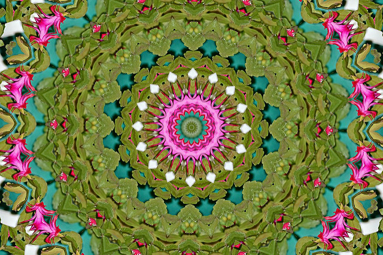
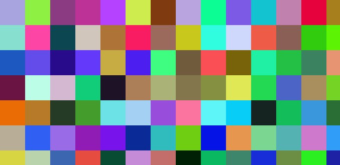
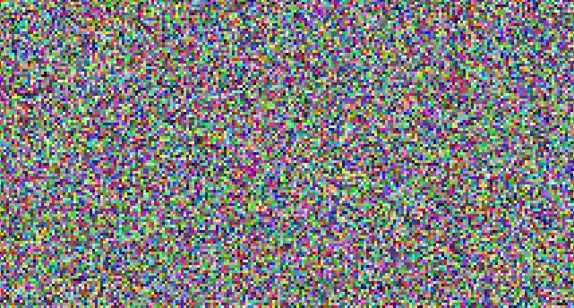

# (Broken) Kaleidoscope

This challenge is designed to help you get more comfortable with managing component state in React.

Here's what you might see if you looked into a typical kaleidoscope:



Ours is broken and won't look that pretty! It will be **colourful**, however.


## Setup

### 0. Cloning and installation
- [ ] Clone this repo, navigate to it, install packages, and start the server with `npm run dev`
  <details style="padding-left: 2em">
    <summary>Tip</summary>

    ```sh
    cd broken-kaleidoscope
    npm i
    npm run dev
    ```
  </details>

- [ ] Visit [http://localhost:3000](http://localhost:3000) in your browser
  <details style="padding-left: 2em">
    <summary>Tip</summary>

    You'll see 'React development has begun!', just to confirm everything is working.
  </details>
  
----

## Render pixels

### 1. Rendering an empty `div`

- [ ] Create a component that only has one job: return a `<div>` using JSX. Let's call it `<Pixel>`
  <details style="padding-left: 2em">
    <summary>More about the <code>&lt;Pixel&gt;</code> component</summary>

    Leave the `<div>` empty. You won't be able to see it yet, but you'll be able to check if it has been rendered using the inspect feature of your browser's development tools. You can call the component whatever you like. We like `<Pixel />` because it evokes the idea of a small colourful square, and that's what we're going to be working with: lots of colourful squares!

- [ ] Place the `<Pixel>` component in the render method of `<App>` so that it'll make it into the DOM
- [ ] Use the browser dev tools to check that it exists, before moving on
  <details style="padding-left: 2em">
    <summary>Tip</summary>

    In the dev tools, it will look like this:

    ```html
    <div id="app">
      <div></div>
    </div>
    ```
  </details>

### 2. Let there be colour

- [ ] Add a `style` attribute on the `<div>` in your component
  <details style="padding-left: 2em">
    <summary>More about styling in JSX</summary>

    We need to see our component. For today, we'll make it visible by using the `style` JSX attribute. This directly corresponds to the `style` attribute on HTML elements, but instead of pure CSS syntax we use a JavaScript object. Here's an example:

    ```jsx
      <div style={{
        fontFamily: 'Times New Roman'
      }}
    ```

    Notice three things about this sample:

    * the *first* set of curly braces indicates that we are using a JavaScript value in JSX
    * the *second* set of curly braces indicates an ordinary JavaScript object literal
    * instead of `font-family`, we use camelcase (`fontFamily`)

    Depending on what you passed to the `style` attribute, you may or may not see a change to the div in the browser, but you should see the style attribute when you inspect it.
  </details>

- [ ] Now, more specifically, add a style that gives the div a height, a width, and a background colour
  <details style="padding-left: 2em">
    <summary>More about these styles</summary>

    The height and width are necessary so that we can *see* the element when it's rendered to the DOM. The colour could be anything you like... use the HTML built-in colours like 'cornflowerblue', for example.

    If you happened to choose that colour, here's what you'd see:

    

    Pretty exciting! Or not. But it gets better...
  </details>

### 3. Go forth and multiply

We're going to need more than one `<Pixel>` here.
- [ ] Go into your `<App>` component and add a bunch more of them. Go wild. Add tons and tons
  <details style="padding-left: 2em">
    <summary>Tip</summary>

    You'll end up with something like this:

    

    Oooooo... k? There sure are a lot of components, but it's kind of hard to distinguish between them. Let's fix that.
  </details>

---

## Introducing component state

### 4. State your business

To easily work with the values we use in the `style` JSX attribute, we should put them into component state.

- [ ] Create a new state called `style`, using the `useState` method. It's initial state should be a suitable style object
  <details style="padding-left: 2em">
    <summary>Tip</summary>

    To review how `useState` is implemented, [see the React docs](https://reactjs.org/docs/hooks-state.html#recap). The example there sets the initial state to `0`, but we will be using an object.
  </details>

- [ ] Next, change your component JSX to refer to `style` instead of including an object literal
  <details style="padding-left: 2em">
    <summary>More about using the `style` state</summary>

    When you're done, there should be no change in the rendered output in your browser: it should work the same whether or not you have the style in state or in the JSX.

    What you've just done is make your component more **flexible**. We can now manipulate the values any way we'd like using the `setStyle` function.

  </details>

### 5. Rainbow pixels

It's high time we stopped being so monochromatic. 
- [ ] **Outside** the `<Pixel>` component, add a function to generate a random colour. Then use it to build the initial `style` state
  <details style="padding-left: 2em">
    <summary>More about generating random colours</summary>
    
    There a number of examples on how to do this out there (try a search on 'random hex color') but the one we like is this (adapted from [this Stack Overflow comment](https://stackoverflow.com/questions/1484506/random-color-generator#comment81414569_5365036)):

    ```js
    const randomHexColor = () =>
      `#${Math.floor(Math.random() * 0x1000000).toString(16).padStart(6, 0)}`
    ```

    Place the above **outside** your `<Pixel>` component. When you've done that, edit the initial state for `style` so that it uses the new function to generate a random hex colour (rather than a string like 'cornflowerblue' or 'red').

    When you refresh the page, what you're aiming for is something like this:

    

    That's more like it!

    > **Do not get bogged down in exactly how `randomHexColor` works!** It's no different to including a Node library in your program, like `fs` or `Knex`: you don't need to understand all the code it contains in order to use it. It's a good instinct to understand the code you put in your program, but we're giving you express permission to copy/paste this one. You can also try it out in the Node REPL to see it in action.
  </details>

### 6. In a state of flux

Usually we define state on our components because **we expect that state to change**. State makes it easier to update our components in response to what the user is doing.

We can illustrate this by responding to some **events**.

<details>
  <summary>More about event handling</summary>

  Here's how it'll go:

  1. user triggers an event (say by clicking the mouse on one of our components)
  2. our **event handler** function is called
  3. we update the component's state which in turn changes its appearance in some way
</details>
<br />

- [ ] In your component, define an **event handler**, and use the event handler to change the component's colour to another random colour
  <details style="padding-left: 2em">
    <summary>More about changing state</summary>
  
    It will look like this:

    ```js
    const clickHandler = evt => {
      setStyle({
        // ... new style here ...
      })
    }
    ```
  </details>

- [ ] Finally, add an `onClick` attribute to your JSX that calls `clickHandler` whenever the component is clicked
- [ ] Check your work in the browser. You should see the `<Pixel>`s change colour when you click on them

> Don't forget to look in the JavaScript console in your devtools to see any errors that might be occurring, especially if the result you see is not what you expected.

---
## Taking it further

### 7. Eventful experiments

Have some fun!
- [ ] Define a bunch of different event handlers and in each one do something different to the component when it triggers
  <details style="padding-left: 2em">
    <summary>Want a list?</summary>
    
    Try:

    * **onMouseEnter**: turn the components green as you pass the mouse over them
    * **onContextMenu**: turn the components black as you right-click on them (hint: checkout `evt.preventDefault()` and `onContextMenu`)
    * **onDoubleClick**: turn the components white
    * **onDragEnter**: turn the components yellow as you click and drag through them
  </details>

### 8. Hi-res

Time to crank up the resolution. 
- [ ] What happens when you render an array of `<Pixel>`s?
  <details style="padding-left: 2em">
    <summary>More about arrays of components</summary>
    
    React is capable of handling plenty of components on the screen at once, so let's test it out a bit. Back in your `<App>` component, instead of manually pasting in `<Pixel>`s like this:

    ```js
      return (
        <div>
          <Pixel />
          <Pixel />
          <Pixel />
        </div>
      )
    ```

    try returning an **array** of components, like this (note the absence of a wrapping div):

    ```js
      return [
        <Pixel />,
        <Pixel />,
        <Pixel />
      ]
    ```

    > The ability to return an array of JSX components was introduced with React 16.
  </details>

- [ ] Programmatically generate an array of **many** `<Pixel>`s, rather than coding them manually
  <details style="padding-left: 2em">
    <summary>More about generating a large array of components</summary>

    Ok, so if we can return an array of components, presumably we can automatically generate an array full of `<Pixel>`s and return that. Create an array containing 100,000 copies of `<Pixel>`. Turn the width and height of the component down to, say, 3 so you'll be able to fit them on the screen!

    > Hint: look up the MDN documentation for [the `Array.from()` syntax](https://developer.mozilla.org/en-US/docs/Web/JavaScript/Reference/Global_Objects/Array/from#Using_arrow_functions_and_Array.from), especially the syntax with `{ length: ... }` specified. You can also use an ordinary `for` loop.

    You should see something that looks a bit like this:

    

    Depending on your computer, you may find that takes several seconds (sometimes 10 or 15) to render. We're pushing React to the limit by rendering so many components at once! If 100,000 components doesn't fill your browser screen, try 200,000! You can also turn the pixel size down to 1 just to see what'll happen, but be warned you'll need a *lot* of components to come close to filling the browser. Don't blame us if your browser stops responding...
  </details>

---

## Stretch

<details>
  <summary>More about stretch challenges</summary>
  
  Reduce the number of components rendered to something reasonable (500-1000) and try changing their colour on a timer every two seconds or so (hint: check out `setInterval`)
</details>
